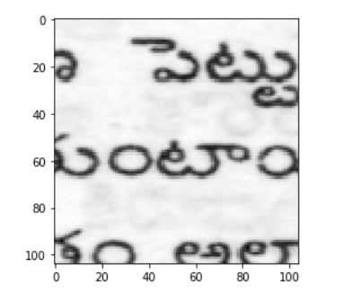
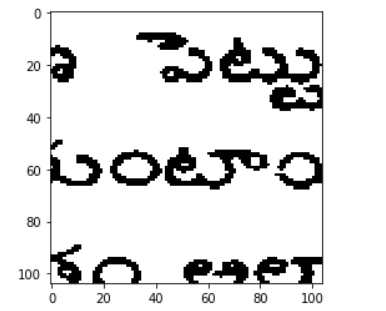

# Document-image-binarization
Using Neural Networks to create do one of the preprocessing steps in OCR i.e Document Image Binarization

## Original Image

## After Binarization

### Still Trying to perfect this thing.
